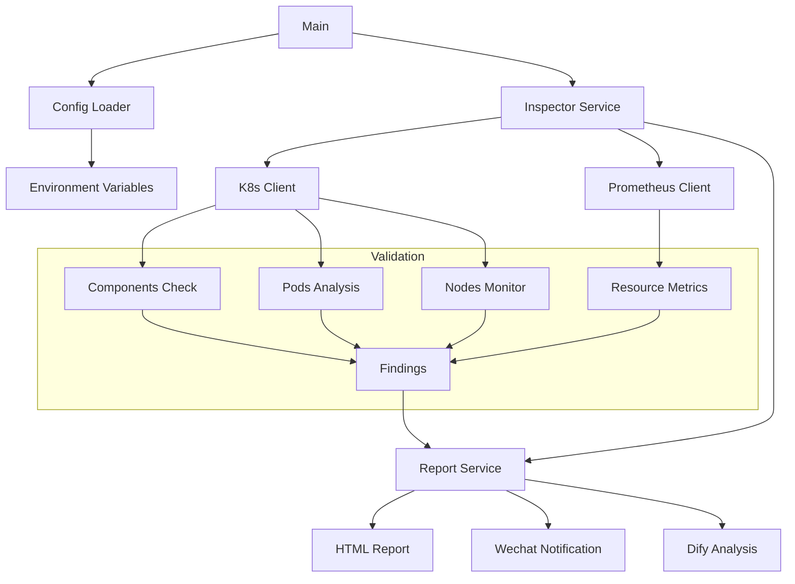

# Kubernetes 集群智能巡检系统架构设计

## 1. 系统概述
基于 Go 语言实现的 Kubernetes 集群自动化巡检系统，主要功能包括：
- 核心组件健康检查（kube-apiserver/etcd/kube-controller-manager/kube-scheduler/coredns）
- 节点资源使用率监控（CPU/Memory/Disk/PID）
- Pod 生命周期状态分析（Running/Pending/Failed）
- 智能异常检测与分级告警（Warning/Critical）
- 多格式报告生成（HTML/企业微信/Dify AI 优化建议）

## 2. 架构设计目标
- **高效性**：
  - 并发检查机制（可配置 MaxConcurrency，默认 10，范围 1-50）
  - 资源阈值监控（Warning/Critical，可配置）
  - 超时控制（API 调用超时可配置，默认 60s）

- **可观测性**：
  - 集成 Prometheus 指标查询
  - 详细的日志记录
  - 分级告警机制（节点/组件/Pod）

- **可扩展性**：
  - 模块化设计
  - 基于接口的服务抽象
  - 统一的类型定义

## 3. 核心组件

### 3.1 配置管理 (pkg/config)
- 环境变量配置加载
- 配置验证和默认值处理
- 阈值和限制管理

### 3.2 检查服务 (pkg/service/inspector)
- 核心组件状态检查
- Pod 状态分析
- 节点资源监控
- 并发控制和错误处理

### 3.3 报告服务 (pkg/service/report)
- HTML 报告生成（go:embed 内置模板）
- 企业微信通知
- 容量优化指标分析
- 报告数据聚合

### 3.4 API 集成
- Prometheus API 客户端 (pkg/api/prometheus)
  - 集群资源使用率查询
  - 节点监控指标获取
- Dify API 客户端 (pkg/api/dify)
  - 智能分析和优化建议
  - 流式响应处理

### 3.5 通知系统 (pkg/notify)
- 企业微信通知 (pkg/notify/wechat)
  - Markdown 格式支持
  - 错误重试机制
  - 消息预览和长度控制

## 4. 数据流



## 5. 目录结构设计

```
k8s-inspector/
├── .github/               # CI 与开源协作配置
├── cmd/                   # 主程序入口
│   ├── inspector/         # 主应用程序
│   └── full-test/         # 报告生成的本地调试入口
├── deploy/                # 部署配置
│   ├── kubernetes/        # K8s 部署文件
├── docs/                  # 项目文档
├── pkg/                   # 公共库代码
│   ├── api/               # API 客户端
│   │   ├── dify/          # Dify API 集成
│   │   └── prometheus/    # Prometheus API 集成
│   ├── notify/            # 通知系统
│   │   └── wechat/        # 微信通知
│   ├── service/           # 业务逻辑层
│   │   ├── inspector/     # 检查服务
│   │   └── report/        # 报告服务
│   ├── types/             # 共享类型定义
│   ├── config/            # 配置管理
├── templates/             # 报告模板（go:embed 内置）
│   ├── embed.go
│   └── report.html
├── Dockerfile             # 容器构建文件
├── go.mod                 # Go 模块定义
├── go.sum                 # Go 依赖校验
└── README.md              # 项目说明
```